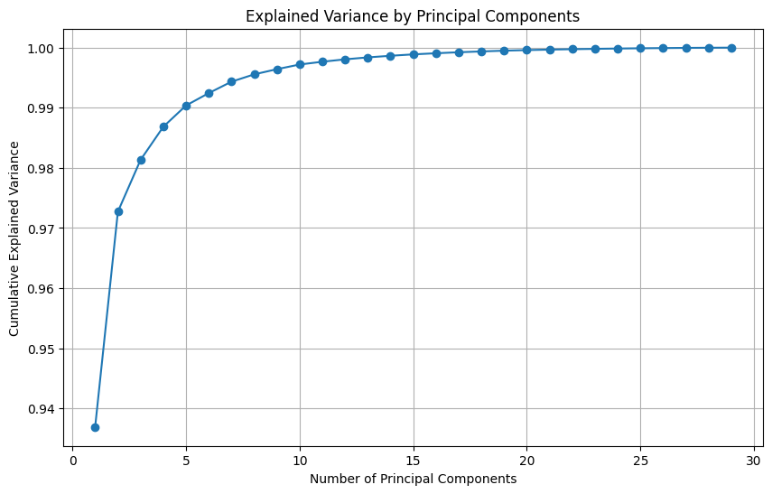
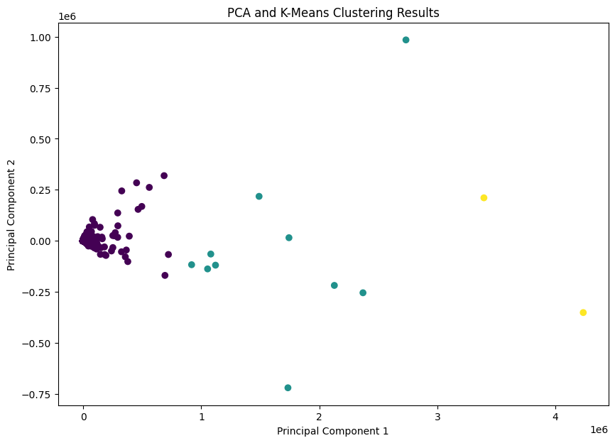

# Gene Expression Classification and Clustering

Machine learning analysis of a high-dimensional GEO expression dataset with a focus on PCA-based classification and cluster separation.

## Overview

This repository contains a notebook-based workflow for analyzing a normalized gene expression matrix from GEO. The project centers on two tasks: a supervised classification experiment built on PCA-reduced features, and an unsupervised clustering analysis used to measure how strongly the expression space separates into distinct groups.

Rather than presenting the work as a packaged bioinformatics library, this repo captures the full experiment flow used for preprocessing, dimensionality reduction, model evaluation, and cluster analysis.

## Dataset

- Source: NCBI GEO `GSE36761`
- Data used in the notebook: normalized gene expression matrix
- Observed matrix shape in the notebook output: 26,521 genes x 30 samples
- Study context: expression profiles from normal and disease-associated samples

The raw GEO exports used in the analysis are included under [`material/`](/Users/lazy/Downloads/GitHub/Statistical_dataAnalysis_genomics/material).

## Core Analysis

### Classification Pipeline

- Log-transform and filter the normalized expression matrix
- Standardize the resulting feature space
- Reduce dimensionality with PCA
- Train an XGBoost classifier on the PCA representation
- Evaluate with accuracy, precision, recall, and F1 score

### Clustering Pipeline

- Project the expression matrix into a lower-dimensional PCA space
- Fit K-means with three clusters
- Visualize separation in principal-component space
- Measure cohesion and separation with silhouette score

## Workflow

The main analysis lives in [`BMEG3105_proj.ipynb`](/Users/lazy/Downloads/GitHub/Statistical_dataAnalysis_genomics/BMEG3105_proj.ipynb) and follows this sequence:

1. Load the normalized expression matrix and inspect dataset shape, summary statistics, and missing values.
2. Apply log transformation to stabilize the expression distribution.
3. Filter low-signal entries using a threshold-based rule.
4. Standardize the filtered features and project them with PCA.
5. Train an XGBoost classifier on the PCA representation.
6. Run K-means clustering on the reduced expression space and assess cluster separation with silhouette score.

## Methods

### Preprocessing

- No missing values were reported in the loaded normalized dataset.
- Expression values were log-transformed before downstream filtering and visualization.
- The notebook applies a threshold-based filter to focus the analysis on more strongly expressed entries.

### Classification

- Feature pipeline: standardization -> PCA -> XGBoost classifier
- Train/test split: 80/20
- Classifier settings: `n_estimators=200`, `max_depth=20`, `learning_rate=0.1`, `subsample=0.8`, `colsample_bytree=0.8`
- Class balancing step in notebook: SMOTE is prepared during training

The classification stage is exploratory rather than a deployment-oriented prediction system. In the notebook, the target is formed by quantile-binning an expression column into three categories, then testing how well the PCA-reduced feature space separates those bins.

### Clustering

- Dimensionality reduction: PCA with 15 components for the clustering stage
- Clustering: K-means with `n_clusters=3`
- Cluster quality metric: silhouette score

## Results

### Classification

The classification experiment is the main supervised result in the notebook. The saved output reports:

- Accuracy: `0.9191`
- Precision: `0.9190`
- Recall: `0.9191`
- F1 score: `0.9190`

Per-class metrics in the saved notebook output are consistently close to `0.88-0.94`, suggesting that the PCA-reduced feature space separates the derived label groups reasonably well within this setup.

The PCA variance curve shows that most of the variance is captured within the early components, supporting the dimensionality-reduction step used before XGBoost classification.

### Clustering

- Silhouette score: `0.9974`

The clustering stage is the strongest unsupervised signal in the project. A silhouette score this high indicates extremely strong separation for the three clusters produced in the PCA-transformed space used by the notebook.

The PCA scatter plot provides a direct view of the cluster structure, making the separation behind the silhouette score easier to interpret at a glance.

## Repository Layout

- [`BMEG3105_proj.ipynb`](/Users/lazy/Downloads/GitHub/Statistical_dataAnalysis_genomics/BMEG3105_proj.ipynb): end-to-end analysis notebook
- [`material/`](/Users/lazy/Downloads/GitHub/Statistical_dataAnalysis_genomics/material): GEO source files and processed expression tables

## Reproducing the Analysis

1. Create a Python environment with the notebook dependencies, including `xgboost`.
2. Open [`BMEG3105_proj.ipynb`](/Users/lazy/Downloads/GitHub/Statistical_dataAnalysis_genomics/BMEG3105_proj.ipynb) in Jupyter.
3. Confirm the notebook can access the normalized expression files in [`material/`](/Users/lazy/Downloads/GitHub/Statistical_dataAnalysis_genomics/material).
4. Run the notebook top to bottom to regenerate the plots, PCA workflow, classification metrics, and clustering results.

## Notes

- This repository is best understood as an exploratory high-dimensional data analysis project rather than a production-ready toolkit.
- The current implementation is notebook-first; a natural next step would be to refactor preprocessing, modeling, and evaluation into reusable Python modules for easier experimentation and validation.
